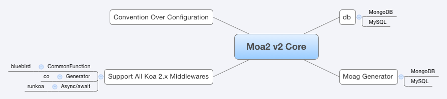

# Moa 2 = Moajs with koa 2.x


Moa2 is a open-source web framework based koa 2.x、mongoose、bluebird、ava that’s optimized
for programmer happiness and sustainable productivity. It lets you
write beautiful code by favoring convention over configuration.

[![gitter][gitter-image]][gitter-url]
[![NPM version][npm-image]][npm-url]

[](https://github.com/feross/standard)


> "Lost, like the Moa is lost" - Maori proverb

## 技术栈



core

- [koa2](https://github.com/koajs/koa/tree/v2.x)
- [bluebird](https://github.com/petkaantonov/bluebird)
- [koa.res.api](https://github.com/moajs/koa.res.api)
- [mount-koa-routes](https://github.com/moajs/mount-koa-routes)

with database

- [rdbms use sequelize](https://github.com/moajs/moa2-sequelize)
- [mongo use mongoose](https://github.com/moajs/moa2-mongo)

## Features

- [x] 自动加载路由
- [x] 使用jsonwebtoken做用户鉴权
- [x] 支持migrate测试
- [x] 支持ava测试
- [x] 默认集成res.api，便于写接口
- [x] 集成supervisor，代码变动，自动重载
- [x] gulp自动监控文件变动，跑测试
- [x] gulp routes生成路由说明
- [x] 使用log4js记录日志


- [x] 支持mongodb配置
- [x] 集成mongoosedao，快速写crud等dao接口
- [ ] 自带用户管理

## Env

- production 产品模式，即部署到服务器上的
- test 测试模式，辅助测试
- development 开发模式，日志上会有差异

举例

```
$ export NODE_ENV=production && ./node_modules/.bin/supervisor ./bin/www
```

or 

```
$ npm run production 
```

## Getting Start

```
$ git clone --depth=1 https://github.com/moajs/moa2.git <your-project-name>
$ cd <your-project-name>
$ npm install
$ npm start
```

Koa 2支持3种中间件，其中async/await需要babel支持，根据[koa、koa2、koa2-async和express的压测性能比较](http://17koa.com/koa-benchmark/)，性能不是特别好，所以默认Moa2不使用`async/await`

说明

- user 是common function
- student 是GeneratorFunction

浏览器里访问地址

- http://127.0.0.1:3000/users
- http://127.0.0.1:3000/students

## 使用脚手架

Install `moag` as Moajs scaffold

```
$ [sudo] npm install --global moag
$ cd <your-project-name>
$ moag <model-name> name:string password:string -k
```

- for koa 2 common function

```
$ moag user name:string password:string -k
```

- for koa2 generator

```
$ moag book name:string password:string -k -g
```

- for koa2 async/await

```
$ moag cup name:string password:string -k -a
```

## 开启async/await

`async/await`需要babel，所以使用[runkoa](https://github.com/17koa/runkoa)可以暂时作为开发用，不建议产品环境使用。

```
$ npm run async
```

## Moajs微信用户组


如果加不上，请加微信`shiren1118`,说明加入原因

## Contributing

1. Fork it
2. Create your feature branch (`git checkout -b my-new-feature`)
3. Commit your changes (`git commit -am 'Add some feature'`)
4. Push to the branch (`git push origin my-new-feature`)
5. Create new Pull Request

## 版本历史

- v1.0.0 初始化版本，以Koa 2.x为基础

## 欢迎fork和反馈

- write by `i5ting` i5ting@126.com

如有建议或意见，请在issue提问或邮件

## License

this repo is released under the [MIT
License](http://www.opensource.org/licenses/MIT).


[npm-image]: https://img.shields.io/npm/v/moa2.svg?style=flat-square
[npm-url]: https://npmjs.org/package/moa2
[gitter-image]: https://badges.gitter.im/Join%20Chat.svg
[gitter-url]: https://gitter.im/moajs/moa2?utm_source=badge&utm_medium=badge&utm_campaign=pr-badge&utm_content=badge